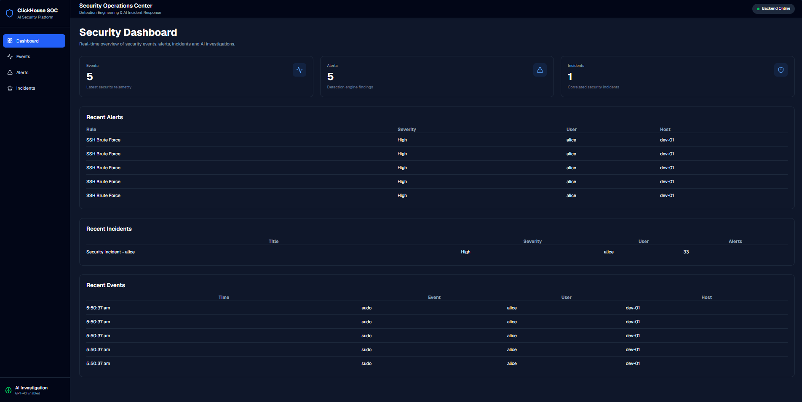
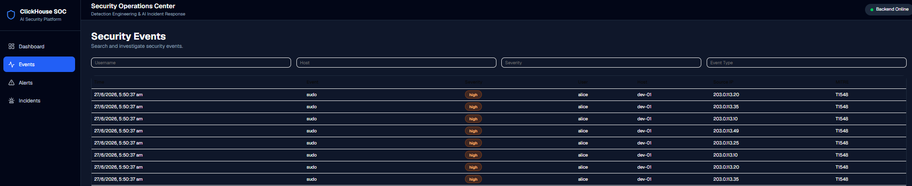
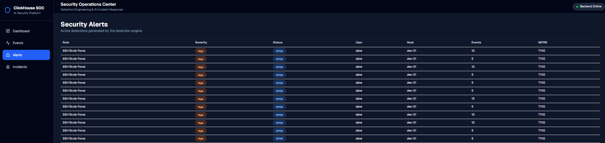
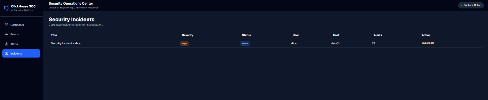
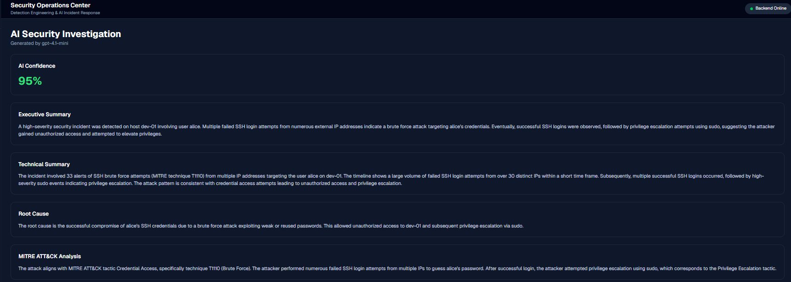
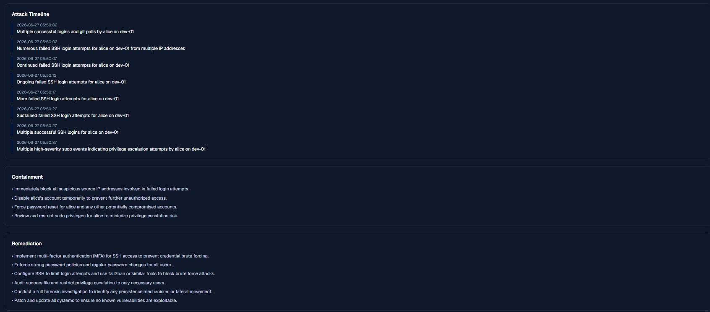

# ClickHouse SOC

> AI-Powered Security Operations Center built with **FastAPI**, **ClickHouse**, **React**, and **OpenAI**.

An end-to-end SOC platform that simulates enterprise security events, detects threats using custom detection rules, correlates alerts into incidents, and generates AI-powered security investigations mapped to the MITRE ATT&CK framework.

---

## Features

- Enterprise Security Event Simulator
- Detection Engineering Pipeline
- Alert Correlation Engine
- Incident Management
- AI Investigation Engine
- MITRE ATT&CK Mapping
- ClickHouse Security Analytics
- Interactive React Dashboard

---

## Technology Stack

### Backend

- FastAPI
- Python
- ClickHouse
- Pydantic
- OpenAI SDK

### Frontend

- React
- TypeScript
- Vite
- React Query
- Tailwind CSS
- shadcn/ui

### Security

- Detection Engineering
- Incident Response
- MITRE ATT&CK
- Threat Hunting
- SOC Analytics

---

## Screenshots

### Dashboard



---

### Events



---

### Alerts



---

### Incidents



---

### AI Investigation




---

# Architecture

```

                    Sample Logs
                         │
                         ▼
               Security Event Simulator
                         │
                         ▼
                  ClickHouse Database
                         │
                         ▼
                 Detection Engine
                         │
                         ▼
                     Alert Engine
                         │
                         ▼
                 Correlation Engine
                         │
                         ▼
                  Incident Engine
                         │
                         ▼
             OpenAI Investigation Engine
                         │
                         ▼
                  FastAPI REST API
                         │
                         ▼
                 React Dashboard
```

---

# Detection Pipeline

1. Generate enterprise security events

2. Store events inside ClickHouse

3. Execute custom SQL detection rules

4. Create security alerts

5. Correlate alerts into incidents

6. Launch AI investigation

7. Persist investigation results

8. Display everything in the React dashboard

---

# AI Investigation Engine

Each investigation gathers:

- Incident metadata
- Related alerts
- Event timeline

The evidence is sent to an OpenAI model which automatically generates:

- Executive Summary
- Technical Summary
- Root Cause Analysis
- MITRE ATT&CK Mapping
- Attack Timeline
- Containment Recommendations
- Remediation Recommendations
- Confidence Score

All investigation results are persisted into ClickHouse.

---

# Future Improvements

- Sigma Rule Support
- YARA-L Integration
- Detection Rule Builder
- IOC Enrichment
- VirusTotal Integration
- Authentication & RBAC
- Live Event Streaming
- Detection Analytics Dashboard
- Case Management
- Multi-Tenant Support
